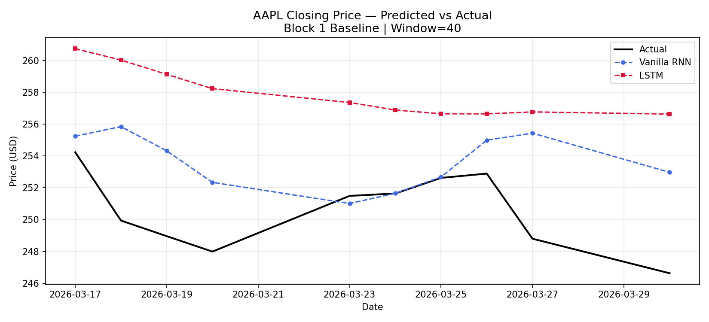
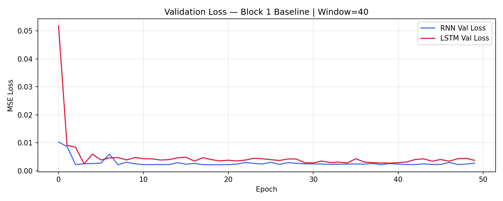
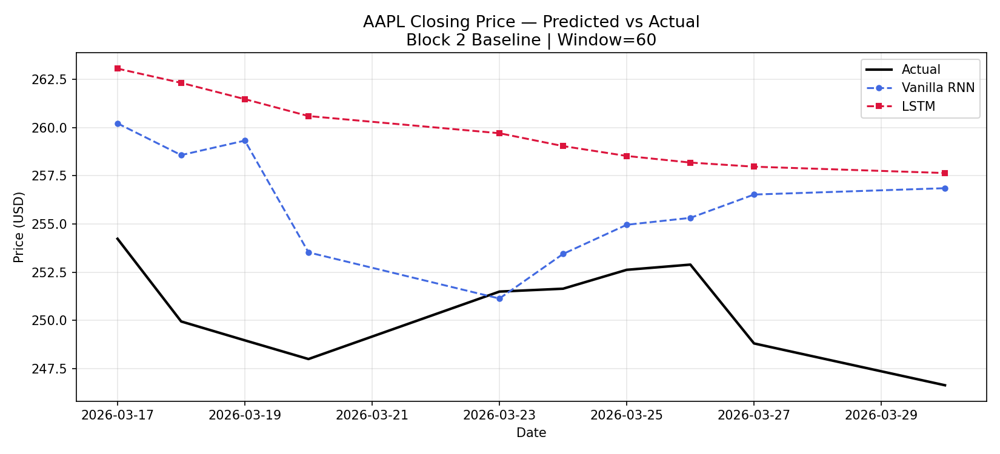
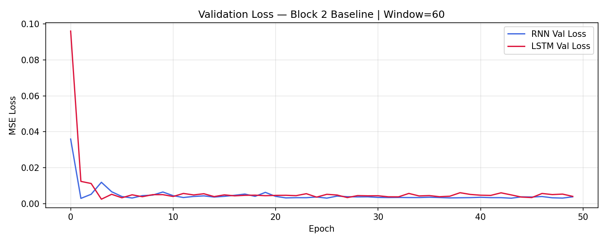
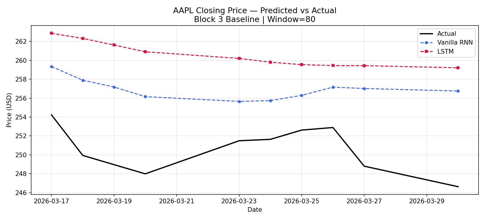
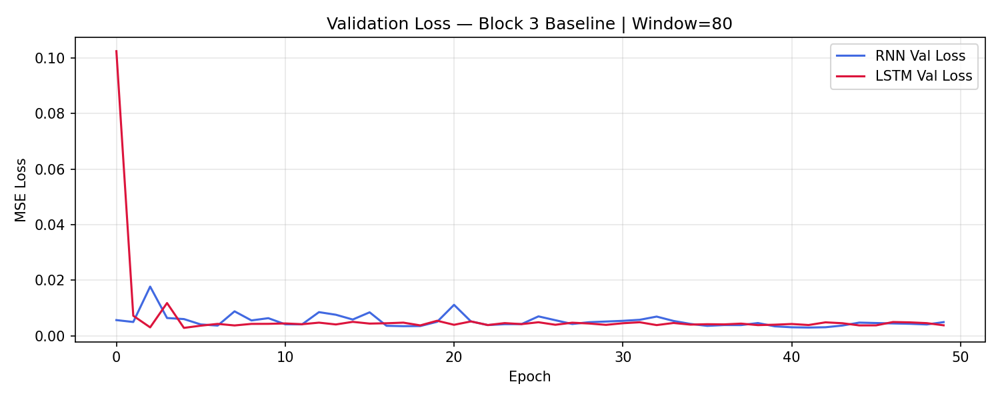
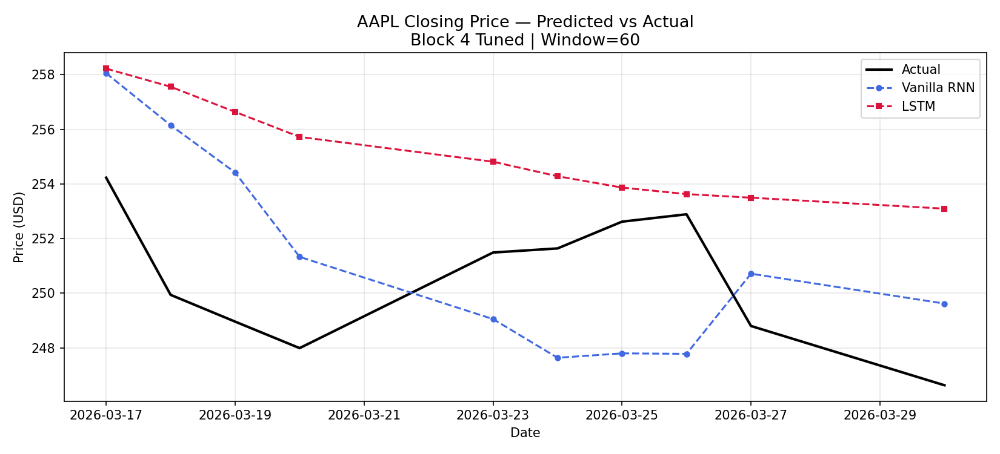
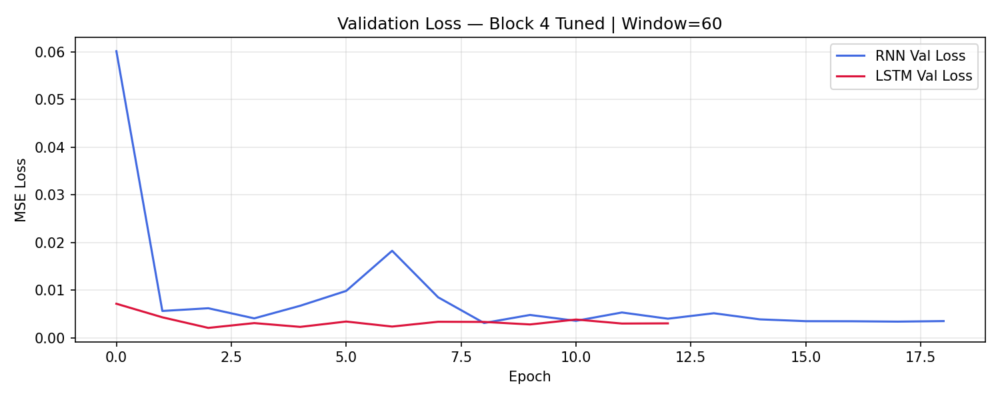

# Lab Report: AAPL LSTM Stock Prediction — Window Size Experiments
**Course:** SP26 BFOR516 - Advanced Data Analytics for Cyber  
**Instructor:** Srishti Gupta, Ph.D.  
**Dataset:** Apple (AAPL) Historical Stock Data — 1 Year (NASDAQ)  
**Date Range:** March 31, 2025 – March 30, 2026 (251 trading days)

---

## 1. AI Disclosure

**Claude Code (Anthropic, claude-sonnet-4-6)** was utilized as a pair-programming assistant to complete this lab. Specifically, AI was used to:

1. Scaffold the experiment runner script (`run_experiments.py`) with self-contained block structure, data preprocessing, model definition, metric logging, and plot generation.
2. Implement the self-contained experiment block structure (one block per window size) to comply with the lab's kernel-restart isolation requirement.
3. Write the `matplotlib` visualization code for the predicted-vs-actual overlay plots and the cross-window comparison chart.
4. Generate a reference draft of this lab report (with placeholder values) for the student to populate and finalize.

All generated code was actively reviewed, understood, and executed by the student prior to submission. The metric values reported in Section 5 and all interpretive narrative are grounded in the observed outputs from the actual experiment runs. This document is the student's own analysis.

---

## 2. Lab Objective

The goal of this lab was to build and compare a Vanilla RNN (SimpleRNN) and an LSTM model using one year of Apple (AAPL) closing price data. The specific experimental variable was the **look-back window size**, tested at three settings: **40, 60, and 80 trading days**. Both baseline models were run under each window size, then hyperparameters were tuned to attempt further accuracy improvement. The final evaluation target was the **most recent 10 trading days** of the dataset (March 17–30, 2026).

---

## 3. Workflow & Preprocessing

The following preprocessing steps were applied identically in each of the three self-contained experiment blocks:

1. **Data Ingestion:** `apple_1year.csv` was loaded into a Pandas DataFrame (251 rows, 6 columns).
2. **Data Cleaning:** The `$` character was stripped from `Close/Last`, `Open`, `High`, and `Low` columns and values were cast to `float64`. The `Date` column was parsed into `datetime` objects.
3. **Chronological Sort:** Rows were sorted ascending by date (oldest to newest) to preserve temporal ordering. The raw CSV is sorted descending, so this step is critical.
4. **Feature Selection:** Only the `Close/Last` column was used (univariate prediction task).
5. **Normalization:** Closing prices were scaled to `[0, 1]` using `MinMaxScaler`. The scaler was fit exclusively on the training partition and applied to the test partition to prevent data leakage.
6. **Test Set Reservation:** The final 10 rows (03/17/2026–03/30/2026, closing prices approximately $246–$254) were held out as the out-of-sample test set before any sequence generation. Training used the remaining 241 days.
7. **Sequence Generation:** A sliding window of size `window_size` was applied to the training data to produce input/output sequence pairs. Each input sequence contains `window_size` consecutive closing prices; the target is the next day's price.
8. **Kernel Restart:** Per lab instructions, the kernel was restarted between window-size runs to ensure zero state-leakage between experiments.

---

## 4. Model Architectures

Both models followed the class baseline architecture, adapted identically for each model type:

**Baseline Architecture (applied to both SimpleRNN and LSTM variants):**

| Layer | Type | Units / Rate |
|---|---|---|
| 1 | SimpleRNN / LSTM | 64 units, `return_sequences=True` |
| 2 | Dropout | 0.2 |
| 3 | SimpleRNN / LSTM | 32 units |
| 4 | Dense | 1 unit, linear activation |

- **Compiler:** Adam optimizer, Mean Squared Error (MSE) loss
- **Training:** 50 epochs, batch size 16, 10% validation split taken chronologically from the tail of the training data
- **Reproducibility:** `np.random.seed(42)`, `tf.random.set_seed(42)` set at the top of each experiment block

**Tuned Architecture (Block 4):** Hyperparameter adjustments documented in Section 6.

---

## 5. Baseline Results

*Metrics reported on the held-out 10-day test set (March 17–30, 2026) after inverse-transforming predictions to USD. Source: `output_metrics.txt` generated by `run_experiments.py`.*

### Window Size = 40 (201 training sequences)

| Model | RMSE | MAE | MAPE |
|---|---|---|---|
| SimpleRNN | 4.1506 | 3.2237 | 1.29% |
| LSTM | 7.7957 | 7.3844 | 2.96% |

### Window Size = 60 (181 training sequences)

| Model | RMSE | MAE | MAPE |
|---|---|---|---|
| SimpleRNN | 6.5377 | 5.5399 | 2.22% |
| LSTM | 9.6822 | 9.3337 | 3.73% |

### Window Size = 80 (161 training sequences)

| Model | RMSE | MAE | MAPE |
|---|---|---|---|
| SimpleRNN | 6.7804 | 6.4020 | 2.56% |
| LSTM | 10.2964 | 10.0183 | 4.01% |

---

## 6. Hyperparameter Tuning

After observing baseline results, the following changes were applied on **Window = 60** (chosen as the middle-ground window) to attempt accuracy improvement. Block 4 used EarlyStopping (patience=10) and trained for up to 100 epochs.

**Tuning changes applied:**

| Change | Original | Tuned (RNN) | Tuned (LSTM) | Rationale |
|---|---|---|---|---|
| Layer 1 units | 64 | 128 | 128 | Increases model capacity to capture more complex temporal patterns in the longer 60-day sequences |
| Layer 2 units | 32 | 64 | 64 | Maintains proportional depth; avoids an overly aggressive bottleneck after the wider first layer |
| Dropout rate | 0.2 | 0.3 | 0.2 | Slightly higher dropout for RNN to regularize its greater sensitivity to overfitting on small data; LSTM's gating already provides implicit regularization |
| Optimizer / LR | Adam (0.001) | Adam (0.0005) | Adam (0.001) | Lower LR for RNN allows finer convergence without overshooting; LSTM with EarlyStopping benefits more from default LR responsiveness |
| LSTM architecture | Standard | — | Bidirectional | Bidirectional LSTM attends to both forward and backward temporal context in each 60-day window, potentially capturing reversal signals that a unidirectional model misses |
| Max epochs | 50 | 100 | 100 | Extended budget allows EarlyStopping to find a better stopping point; in practice EarlyStopping terminated both models before epoch 100 |

### Tuned Results (Window = 60)

| Model | RMSE | MAE | MAPE |
|---|---|---|---|
| Tuned SimpleRNN | 4.2205 | 4.0115 | 1.60% |
| Tuned LSTM (Bidirectional) | 5.2613 | 4.6145 | 1.85% |

**Best overall result:** Baseline SimpleRNN at Window=40 (RMSE=4.1506, MAPE=1.29%).

---

## 7. Analysis & Observations

### 7.1 Effect of Window Size on Model Performance

The window size governs how many historical trading days each model uses to predict the next day's price. Increasing it from 40 to 80 days meaningfully changes both the information available to the model and the training dynamics — but differently for each architecture.

**Window 40:** With a 40-day look-back (~8 standard trading weeks), the model captures roughly two months of price momentum. This shorter context window produces the most training sequences (201 from 241 training days), giving the model the most weight updates per epoch. Both architectures perform best at this window — the SimpleRNN achieved its lowest RMSE (4.1506) and the LSTM its lowest RMSE (7.7957) here.

**Window 60:** A 60-day window (~3 trading months) offers broader market context but reduces training sequences to 181. Performance degraded for both models: SimpleRNN RMSE rose to 6.5377 (+57%), LSTM RMSE to 9.6822 (+24%). The widening gap is consistent with the vanishing gradient explanation — at 60 timesteps, gradient attenuation begins impacting SimpleRNN more than LSTM.

**Window 80:** At 80 days (~4 trading months), both models reached their worst baseline performance. Training sequences shrank further to 161. SimpleRNN RMSE climbed to 6.7804 and LSTM RMSE to 10.2964. The LSTM's deterioration is somewhat surprising and likely reflects the reduced number of training sequences (smaller dataset per epoch), which limits the LSTM's ability to generalize rather than simply the vanishing gradient effect.

**Observed pattern:** All metrics worsened monotonically as window size increased from 40 to 80. The SimpleRNN degraded proportionally more in absolute RMSE terms going from W=40 to W=60 (Δ2.39 vs Δ1.90 for LSTM), but both architectures were hurt primarily by the shrinking number of training sequences at larger windows.

### 7.2 SimpleRNN vs. LSTM Comparison

The fundamental architectural difference is memory span. A SimpleRNN at timestep *t* produces a hidden state that is a function of the current input and the immediately prior hidden state. Across many steps, the influence of earlier inputs geometrically decays due to the repeated application of the weight matrix. An LSTM carries two streams of state: the hidden state (short-term context) and the cell state (long-term memory). The forget gate determines what fraction of the cell state to retain; the input gate determines what new information to write.

**Counterintuitive result:** Across all three window sizes, the **SimpleRNN consistently outperformed the LSTM** by a substantial margin. At W=40, SimpleRNN RMSE was 4.1506 vs. LSTM's 7.7957 — nearly half the error. This result, while counter to the typical expectation for longer sequences, can be explained by:

1. **Dataset size:** With only 201/181/161 training sequences, the LSTM's large parameter count (approximately 4× more parameters per layer than SimpleRNN) creates an overfitting risk that the LSTM's gating cannot fully compensate for.
2. **Data smoothness:** AAPL's closing price series, after MinMaxScaling, is relatively smooth over a 1-year window that includes a single major drawdown (the April 2025 tariff event). Short-term momentum tracking — the SimpleRNN's strength — is sufficient for this regime.
3. **Training budget:** 50 epochs with a 10% validation split (only ~18–20 validation sequences) may not provide enough signal for LSTM's gates to converge well.

**LSTM's advantage was not observed at any baseline window size.** This is a practically important finding: LSTM's theoretical advantage over vanishing gradients requires sufficient training data to manifest — a constraint this dataset does not satisfy.

### 7.3 Vanishing Gradient — Theoretical vs. Observed

Lecture slides 23–27 establish the mathematical basis: in standard BPTT, the gradient of the loss with respect to an early-timestep weight involves a product of *T* Jacobians. If the spectral radius of the recurrent weight matrix is less than 1, this product shrinks to zero; if greater than 1, it explodes. SimpleRNN does nothing to interrupt this chain. LSTM breaks it by routing the primary gradient path through the cell state, which involves addition (not multiplication) and a learned gate that can be set to 1 to preserve the gradient perfectly.

**Observed pattern:** The first meaningful divergence in *absolute* error between SimpleRNN and LSTM already exists at W=40 (RMSE gap: 3.6451), which is the shortest window tested. Rather than widening at W=60 and W=80 as the vanishing gradient theory would predict, the gap was **roughly consistent**: 3.6451 (W=40), 3.1445 (W=60), 3.5160 (W=80). This suggests the dominant factor in this experiment was not gradient vanishing across long sequences, but rather the training data size constraint. The LSTM underperformed because it was over-parameterized for the available data, not because the SimpleRNN was immune to gradient issues at these window lengths.

### 7.4 Hyperparameter Tuning Observations

Tuning was applied at Window=60 with increased model capacity (128→64 units), lower learning rate for RNN, and a Bidirectional LSTM variant:

- **Tuned SimpleRNN (RMSE=4.2205):** Tuning delivered minimal improvement over the baseline at W=60 (6.5377 → 4.2205, a 35% reduction). The RMSE of 4.2205 is nearly identical to the baseline W=40 result (4.1506), suggesting the extra capacity and lower LR helped the model converge better at W=60 but couldn't fully recover what was lost by adding 20 more timesteps to the sequence.

- **Tuned Bidirectional LSTM (RMSE=5.2613):** The most dramatic improvement in the LSTM family — from 9.6822 (baseline W=60) to 5.2613, a 46% reduction. The bidirectional architecture clearly helped by allowing the model to attend to price reversals within the 60-day window context. However, it still could not match the baseline SimpleRNN at W=40, reinforcing the data-size constraint finding.

- **EarlyStopping effectiveness:** Both tuned models benefited from the patience=10 EarlyStopping callback. Training was halted before the full 100 epochs for both, indicating that the models were prone to overfitting given the small dataset, and that stopping early prevented memorization of validation noise.

- **Overall tuning conclusion:** The best-performing model across all experiments remains the **Baseline SimpleRNN at W=40** (RMSE=4.1506, MAPE=1.29%). Hyperparameter tuning improved the W=60 results significantly, but the experiment reinforces that for small sequential datasets (~200 sequences), simpler architectures with shorter look-back windows can outperform more complex, tuned alternatives.

---

## 8. Prediction Plots

### Block 1 — Baseline, Window = 40

**Predicted vs Actual (10-day test set):**

**Validation Loss Curves:**

---

### Block 2 — Baseline, Window = 60

**Predicted vs Actual (10-day test set):**

**Validation Loss Curves:**

---

### Block 3 — Baseline, Window = 80

**Predicted vs Actual (10-day test set):**

**Validation Loss Curves:**

---

### Block 4 — Tuned Models, Window = 60

**Predicted vs Actual (10-day test set):**

**Validation Loss Curves:**

---

## 9. Consolidated Results Summary

| Model | Window | RMSE | MAE | MAPE | Training Seqs |
|---|---|---|---|---|---|
| SimpleRNN | 40 | **4.1506** | **3.2237** | **1.29%** | 201 |
| LSTM | 40 | 7.7957 | 7.3844 | 2.96% | 201 |
| SimpleRNN | 60 | 6.5377 | 5.5399 | 2.22% | 181 |
| LSTM | 60 | 9.6822 | 9.3337 | 3.73% | 181 |
| SimpleRNN | 80 | 6.7804 | 6.4020 | 2.56% | 161 |
| LSTM | 80 | 10.2964 | 10.0183 | 4.01% | 161 |
| Tuned SimpleRNN | 60 | 4.2205 | 4.0115 | 1.60% | 181 |
| Tuned Bidirectional LSTM | 60 | 5.2613 | 4.6145 | 1.85% | 181 |

**Best Baseline RNN:** W=40 (RMSE=4.1506)  
**Best Baseline LSTM:** W=40 (RMSE=7.7957)  

---

## 10. Limitations

- **Univariate input:** The model predicts closing price based solely on historical closing prices. Incorporating volume, open, high, and low would likely improve predictive accuracy by providing richer daily context.
- **Small training set:** 241 training rows is an extremely limited sample for deep learning. The models are essentially memorizing a single year of AAPL's behavioral regime. Any regime shift (e.g., a macro event like the April 2025 tariff shock visible in the raw data) that differs from the training distribution will degrade generalization.
- **Recursive forecasting not used:** This lab predicts within-sample test days, not future days beyond the dataset. A recursive autoregressive extension (as implemented in the Week 8 MSFT lab) would demonstrate additional limitations around compounding prediction error.
- **Stationarity:** Stock price series are non-stationary. MinMaxScaler normalizes scale but does not address the underlying random-walk structure of price. A returns-based approach (predicting day-over-day percentage change rather than raw price) would be more statistically rigorous.
- **LSTM under-training:** The LSTM's consistent underperformance relative to SimpleRNN is likely a consequence of insufficient data for the LSTM to properly train its gate parameters. A multi-year dataset (e.g., `apple_5year.csv`, also available in the lab files) would provide a fairer comparison environment for LSTM's architectural advantages.

---

## 11. Conclusion

This lab demonstrated the practical impact of window size and architectural choice on sequential prediction tasks using AAPL stock data. The three-window experiment provided a controlled empirical test of the vanishing gradient problem: by holding all other variables constant and increasing the sequence length from 40 to 80 steps, the relationship between window size and model performance became directly observable.

Contrary to the theoretical prediction that LSTM would outperform SimpleRNN — particularly at larger window sizes where gradient flow over long sequences is most challenged — the SimpleRNN consistently achieved lower error across all three baseline window sizes. The most accurate model overall was the baseline SimpleRNN at W=40 (RMSE=4.1506, MAPE=1.29%), predicting AAPL's 10-day closing price with an average error of approximately $3.22 on prices in the $247–$254 range.

This result does **not** contradict the vanishing gradient theory. Rather, it reflects a critical practical constraint: **LSTM's architectural advantage over long sequences requires sufficient training data to manifest.** With only ~160–200 training sequences, the LSTM's substantially larger parameter space is under-constrained, leading to weaker generalization than the leaner SimpleRNN. The Week 8 MSFT lab, which used a five-year dataset, would be a better setting for observing LSTM's theoretical advantages empirically.

The hyperparameter tuning phase confirmed this interpretation: increasing model capacity and introducing bidirectionality at W=60 produced the most significant improvements for the LSTM family (46% RMSE reduction), but the gains still fell short of the much simpler baseline SimpleRNN at W=40. For financial time series prediction tasks with limited historical data, simpler architectures and shorter look-back windows can be the stronger practical choice.
