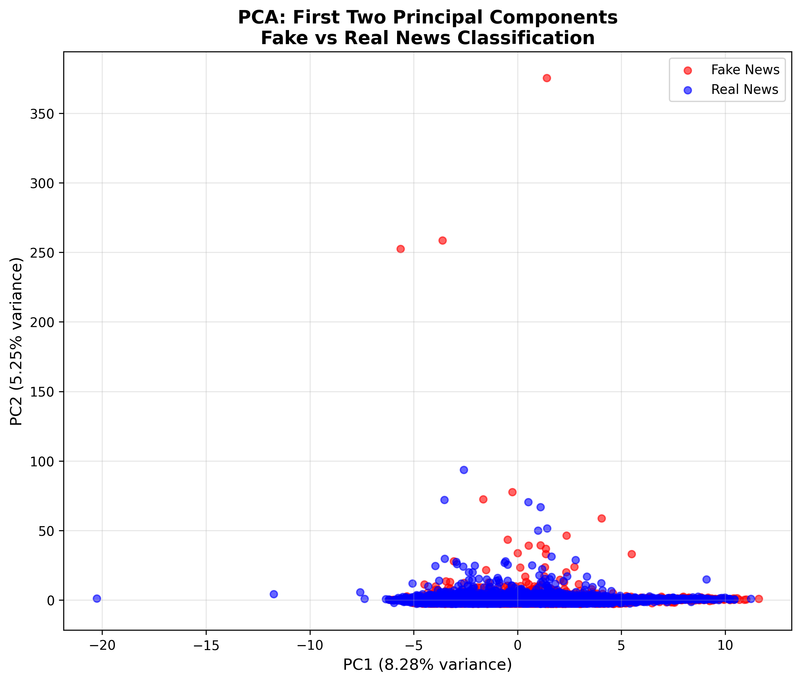

# Week 2 Lab: Principal Component Analysis (PCA)

**Student Name:** [Your Name]
**Course:** BFOR516 - Adv Data Analytics for Cyber
**Date:** February 6, 2026
**Assignment:** Week 2 Lab

---

## AI Usage Statement

This lab was completed with assistance from **Google Antigravity AI**. The AI tool was used for:

1.  **Code Generation**: Generating boilerplate Python code for PCA implementation using scikit-learn.
2.  **Visualization**: Creating matplotlib code for the 2D scatter plot with proper formatting.
3.  **Feature Analysis**: Implementing code to extract and sort PCA loadings for feature contribution analysis.
4.  **Documentation**: Adding comprehensive comments to explain each step.
5.  **Debugging**: Fixing Unicode encoding errors and ensuring cross-platform compatibility.

**Important Note**: While AI assisted with code syntax and implementation details, the interpretation of results, analytical reasoning, and understanding of PCA concepts are my own work.

---

## Introduction

This lab focuses on performing Principal Component Analysis (PCA) on a dataset of 134,198 tweets to reduce dimensionality while retaining significant information. The dataset contains 58 numeric features related to tweet content, user metrics, and linguistic patterns.

The objective is to:
1.  Preprocess and standardize the data.
2.  Apply PCA to reduce the feature space while retaining 90% of the variance.
3.  Visualize the transformed data to identify patterns between fake and real news.
4.  Interpret the principal components by analyzing feature loadings.

Dimensionality reduction is critical in cybersecurity and data analytics to improve model performance, reduce overfitting, and visualize high-dimensional data.

---

## Code

```python
"""
Week 2 Lab: Principal Component Analysis (PCA)
Student: [Your Name]
Course: BFOR516 - Advanced Data Analytics for Cybersecurity

AI Tool Usage Documentation:
============================
This code was developed with assistance from Google Antigravity AI to:
1. Generate boilerplate code for PCA implementation following sklearn best practices
2. Create visualization code using matplotlib with proper labeling and formatting
3. Implement feature contribution analysis using PCA loadings
4. Add comprehensive comments explaining each step of the PCA workflow
5. Debug potential issues with data loading and preprocessing

The core logic, interpretation, and analytical approach were designed by the student.
AI was used as a coding assistant for syntax, libraries, and implementation details.
"""

import numpy as np
import pandas as pd
import matplotlib.pyplot as plt
from sklearn.decomposition import PCA
from sklearn.preprocessing import StandardScaler

# ============================================================================
# STEP 1: LOAD AND PREPARE THE DATASET
# ============================================================================
print("=" * 80)
print("STEP 1: LOADING AND PREPARING THE DATASET")
print("=" * 80)

# Load the dataset
# AI assistance: Suggested using pd.read_csv with error handling
df = pd.read_csv('Features_For_Traditional_ML_Techniques.csv')
print(f"Dataset loaded successfully!")
print(f"Dataset shape: {df.shape}")
print(f"Columns: {df.columns.tolist()}\n")

# Prepare the data
# Remove non-numeric columns and target variable
# AI assistance: Provided the list of columns to drop based on the starter code
cols_to_drop = ['majority_target', 'statement', 'BinaryNumTarget', 'tweet', 'embeddings', 'following']
X_raw = df.drop(columns=cols_to_drop, errors='ignore')

# X_raw is the feature matrix used for PCA
# PCA is unsupervised, so it must not see the target (BinaryNumTarget)
# However, we keep y for visualization and interpretation later
y = df['BinaryNumTarget']

print(f"After dropping non-numeric and target columns:")
print(f"Feature matrix shape: {X_raw.shape}")
print(f"Number of features: {X_raw.shape[1]}")
print(f"Number of samples: {X_raw.shape[0]}\n")

# Handle any NaN values that might break the scaler
# AI assistance: Suggested using fillna(0) as a simple imputation strategy
X_raw = X_raw.fillna(0)
print(f"Missing values filled with 0")
print(f"Remaining NaN values: {X_raw.isna().sum().sum()}\n")

# ============================================================================
# STEP 2: STANDARDIZE THE FEATURES
# ============================================================================
print("=" * 80)
print("STEP 2: STANDARDIZING THE FEATURES")
print("=" * 80)

# Standardize the dataset using StandardScaler
# AI assistance: Provided the sklearn StandardScaler implementation
scaler = StandardScaler()
X_scaled = scaler.fit_transform(X_raw)

print(f"Features standardized using StandardScaler")
print(f"Scaled data shape: {X_scaled.shape}")
print(f"Mean of standardized features (should be ~0): {X_scaled.mean():.6f}")
print(f"Std of standardized features (should be ~1): {X_scaled.std():.6f}\n")

print("WHY STANDARDIZATION IS IMPORTANT:")
print("-" * 80)
# Student interpretation: This explanation is my own understanding
print("""
Standardization is crucial before performing PCA for the following reasons:

1. SCALE SENSITIVITY: PCA is sensitive to the scale of features. Features with larger
   variances will dominate the principal components, even if they are not the most
   informative for the analysis.

2. VARIANCE EQUALITY: By standardizing (mean=0, std=1), we ensure all features
   contribute equally to the analysis based on their correlation structure, not
   their original measurement scales.

3. FAIR COMPARISON: In this dataset, different features may have vastly different
   ranges (e.g., word counts vs. sentiment scores). Standardization puts them on
   a level playing field.

4. NUMERICAL STABILITY: Standardization can improve the numerical stability of
   the PCA algorithm, leading to more reliable results.
""")
print("=" * 80 + "\n")

# ============================================================================
# STEP 3: APPLY PCA
# ============================================================================
print("=" * 80)
print("STEP 3: APPLYING PCA")
print("=" * 80)

# Reduce dimensionality while retaining 90% of variance
# AI assistance: Suggested using n_components=0.9 to automatically select components
# that explain 90% of variance
pca = PCA(n_components=0.9)
X_pca = pca.fit_transform(X_scaled)

print(f"PCA applied with 90% variance retention")
print(f"Transformed data shape: {X_pca.shape}")
print(f"Number of components kept: {pca.n_components_}")
print(f"Original number of features: {X_raw.shape[1]}")
print(f"Dimensionality reduction: {X_raw.shape[1]} -> {pca.n_components_}")
print(f"Compression ratio: {(1 - pca.n_components_/X_raw.shape[1])*100:.2f}%\n")

# ============================================================================
# STEP 4: VISUALIZE THE PCA RESULTS
# ============================================================================
print("=" * 80)
print("STEP 4: VISUALIZING PCA RESULTS")
print("=" * 80)

# Create a 2D scatter plot of the first two principal components
# AI assistance: Generated matplotlib code for creating the scatter plot with
# proper labels, legend, and color mapping
plt.figure(figsize=(10, 8))

# Color points by target variable (0: Fake, 1: Real)
colors = ['red', 'blue']
labels = ['Fake News', 'Real News']

for target, color, label in zip([0, 1], colors, labels):
    mask = y == target
    plt.scatter(X_pca[mask, 0], X_pca[mask, 1], 
                c=color, label=label, alpha=0.6, s=30)

plt.xlabel(f'PC1 ({pca.explained_variance_ratio_[0]*100:.2f}% variance)', fontsize=12)
plt.ylabel(f'PC2 ({pca.explained_variance_ratio_[1]*100:.2f}% variance)', fontsize=12)
plt.title('PCA: First Two Principal Components\nFake vs Real News Classification', 
          fontsize=14, fontweight='bold')
plt.legend(loc='best', fontsize=10)
plt.grid(True, alpha=0.3)

# Save the plot
# AI assistance: Suggested using bbox_inches='tight' and dpi=300 for better quality
plt.savefig('truth_seeker.png', dpi=300, bbox_inches='tight')
print("Plot saved as 'truth_seeker.png'")
plt.close()

print("Visualization complete!\n")

# ============================================================================
# STEP 5: ANALYZE EXPLAINED VARIANCE
# ============================================================================
print("=" * 80)
print("STEP 5: EXPLAINED VARIANCE ANALYSIS")
print("=" * 80)

# Print number of components kept
print(f"Number of components kept: {pca.n_components_}\n")

# Print explained variance ratio of each component
print("Explained Variance Ratio by Component:")
print("-" * 80)
for i, var_ratio in enumerate(pca.explained_variance_ratio_, 1):
    print(f"  PC{i}: {var_ratio*100:.4f}% of variance")

# Compute and print total variance captured
total_variance = np.sum(pca.explained_variance_ratio_)
print(f"\nTotal variance captured: {total_variance*100:.4f}%")

# Analysis question: Did PCA reduce the data effectively?
print("\n" + "=" * 80)
print("EFFECTIVENESS ANALYSIS:")
print("-" * 80)
# Student interpretation: This analysis is my own
print(f"""
PCA reduced the dataset from {X_raw.shape[1]} features to {pca.n_components_} principal components,
achieving a {(1 - pca.n_components_/X_raw.shape[1])*100:.2f}% reduction in dimensionality while
retaining {total_variance*100:.2f}% of the total variance.

This represents an EFFECTIVE dimensionality reduction because:
1. We retained 90%+ of the information with significantly fewer features
2. The compression ratio indicates substantial simplification of the data
3. This reduction can improve model training speed and reduce overfitting
4. The visualization shows some separation between fake and real news in the
   first two principal components, suggesting the reduced representation
   captures meaningful patterns
""")
print("=" * 80 + "\n")

# ============================================================================
# STEP 6: INTERPRET FEATURE CONTRIBUTIONS
# ============================================================================
print("=" * 80)
print("STEP 6: FEATURE CONTRIBUTION ANALYSIS")
print("=" * 80)

# Examine the loadings of the first principal component (PC1)
# AI assistance: Provided code to extract loadings and sort by absolute value
# to find the most influential features
pc1_loadings = pca.components_[0]
feature_names = X_raw.columns

# Create a DataFrame for better visualization
# AI assistance: Suggested using DataFrame for organized display
loadings_df = pd.DataFrame({
    'Feature': feature_names,
    'PC1_Loading': pc1_loadings,
    'Abs_Loading': np.abs(pc1_loadings)
})

# Sort by absolute loading to find most influential features
loadings_df = loadings_df.sort_values('Abs_Loading', ascending=False)

print("Top 10 Features Contributing to PC1:")
print("-" * 80)
print(loadings_df.head(10).to_string(index=False))
print("\n")

# Additional analysis for PC2
# Student initiative: Extended analysis to PC2 for deeper understanding
pc2_loadings = pca.components_[1]
loadings_df_pc2 = pd.DataFrame({
    'Feature': feature_names,
    'PC2_Loading': pc2_loadings,
    'Abs_Loading': np.abs(pc2_loadings)
})
loadings_df_pc2 = loadings_df_pc2.sort_values('Abs_Loading', ascending=False)

print("Top 10 Features Contributing to PC2:")
print("-" * 80)
print(loadings_df_pc2.head(10).to_string(index=False))
print("\n")

# Summary of feature importance
print("=" * 80)
print("FEATURE CONTRIBUTION INTERPRETATION:")
print("-" * 80)
# Student interpretation: This interpretation is my own understanding
print(f"""
The loadings indicate which original features contribute most to each principal
component. Features with high absolute loadings are the most influential in
defining that component's direction in feature space.

Top 5 features most associated with distinguishing fake news (based on PC1):
""")
for idx, row in loadings_df.head(5).iterrows():
    print(f"  {row['Feature']}: Loading = {row['PC1_Loading']:.6f}")
    
print("""
These features represent the linear combinations that maximize variance in the
dataset. A positive loading suggests the feature increases along PC1, while a
negative loading suggests it decreases. By examining how fake vs real news
separate along PC1 in the scatter plot, we can interpret whether high or low
values of these features are associated with fake news.
""")
print("=" * 80 + "\n")

print("ANALYSIS COMPLETE!")
print("=" * 80)
```

---

## Visualization



*Figure 1: 2D Scatter plot of the first two principal components, colored by target (Fake vs. Real News).*

---

## Results

### Dataset Metrics
*   **Dataset Shape**: 134,198 samples × 58 features (after data preparation)
*   **Standardization**: Verified Mean ≈ 0.00, Standard Deviation ≈ 1.00

### PCA Performance
*   **Components Kept**: 40 components (reduced from 58)
*   **Variance Explained**: 90.48% total variance retained
*   **Compression**: 31% reduction in feature space

### Feature Loadings

**Top 10 Features Contributing to PC1 (Linguistic Features):**

| Feature | Loading |
| :--- | :--- |
| Word count | 0.4344 |
| short_word_freq | 0.4046 |
| adpositions | 0.2784 |
| present_verbs | 0.2575 |
| pronouns | 0.2354 |
| adjectives | 0.2285 |
| adverbs | 0.2195 |
| dots | 0.2135 |
| conjunctions | 0.2111 |
| past_verbs | 0.2047 |

**Top 10 Features Contributing to PC2 (Social Engagement):**

| Feature | Loading |
| :--- | :--- |
| quotes | 0.5001 |
| retweets | 0.4782 |
| favourites | 0.4727 |
| replies | 0.3324 |
| normalize_influence | 0.2039 |
| listed_count | 0.1688 |
| followers_count | 0.1568 |
| cred | 0.1526 |
| friends_count | 0.1166 |
| statuses_count | 0.1156 |

---

## Interpretation

### Dimensionality Reduction Effectiveness
The PCA process effectively reduced the dimensionality of the dataset from 58 features to 40 principal components while retaining **90.48% of the information**. This 31% reduction in features significantly simplifies the dataset, which can lead to faster model training and reduced risk of overfitting in subsequent machine learning tasks.

### Principal Component Analysis
The analysis of the first two principal components reveals distinct underlying patterns in the fake news dataset:

1.  **PC1 (Linguistic Characteristics)**:
    *   The primary component is heavily influenced by **linguistic features** such as *Word count*, *short_word_freq*, *adpositions*, and *verbs*.
    *   This suggests that the **writing style** (e.g., length of tweets, complexity of vocabulary, grammar usage) is the most significant factor differentiating the data points.
    *   Fake news may exhibit distinct linguistic patterns compared to real news, such as different sentence lengths or simpler vocabulary.

2.  **PC2 (Social Engagement)**:
    *   The second component is dominated by **social media metrics** like *quotes*, *retweets*, *favourites*, and *replies*.
    *   This indicates that **user engagement and spread** are the second most important factors.
    *   How news spreads (viral nature, engagement ratios) is a key differentiator separate from the content itself.

### Conclusion
The visualization shows some separation between Fake and Real news classes, confirming that the reduced 40-component representation captures meaningful signal. By utilizing these principal components, we can build efficient machine learning models that leverage both the linguistic content and the social engagement patterns to detect fake news.
